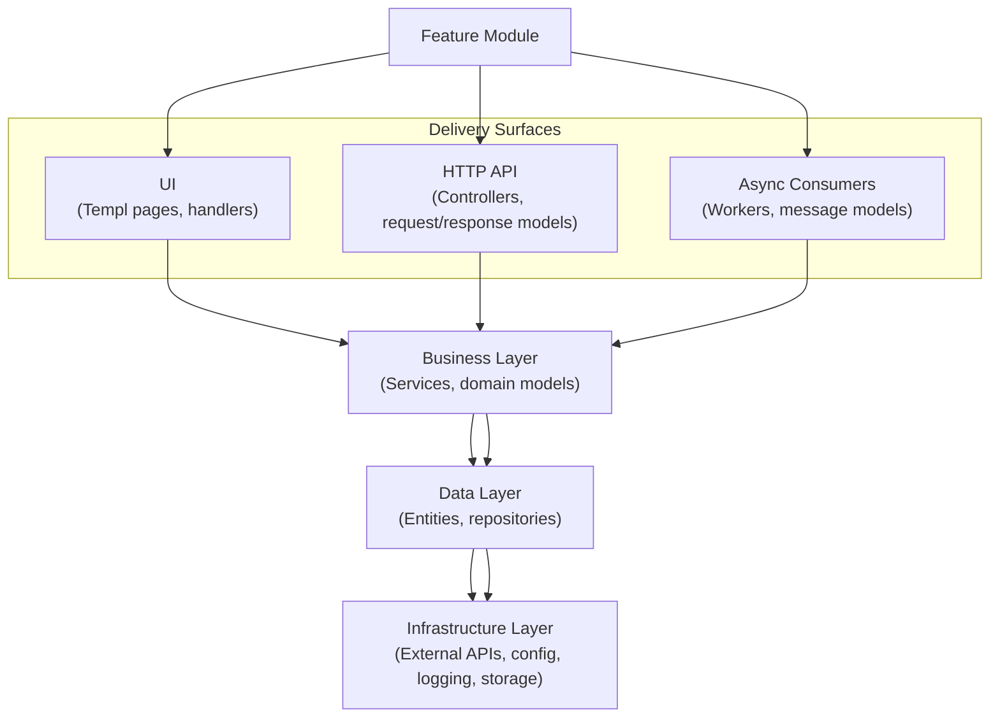
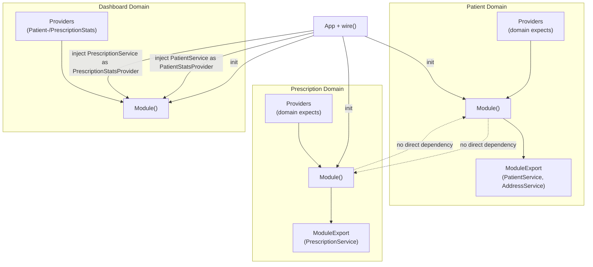

# Architecture Guide

## Project Goals
- Give every future service a clear starting point.
- Keep domains separate so we only connect them on purpose.
- Let delivery layers (web pages, HTTP APIs, background workers) stay light and focus on calling the business code.
- Make it easy to swap logging, integrations, or storage without touching the domain logic.

## How the App Starts
1. `cmd/server/main.go` loads config values and creates `internal/app.App`.
2. `internal/app/app.go` calls `wire()` in `internal/app/wire.go` to build the logger, router, integrations, and modules.
3. The router gets standard middleware (request IDs, correlation IDs, Zap logging, panic recovery, timeout) and serves static files from `web/public`.
4. Each domain exposes a `Module` function. `wire()` calls those modules so their APIs and UIs are mounted and their services are ready.
5. `App.Run()` starts the HTTP server with the router and port from the config.

## Project Layout
- `cmd/` – Executables. `cmd/server` runs the app. `cmd/iris_mock` starts a fake external service.
- `domain/` – Each business area (dashboard, patient, prescription). Domains keep their own API, service, repository, and UI code.
- `internal/app/` – The place where we build everything and wire dependencies.
- `internal/platform/` – Shared infrastructure such as config, logging, and HTTP helpers.
- `internal/integrations/` – Wrappers for outside systems (Iris Pharmacy, Iris Billing).
- `internal/configs/` – Default YAML config files.
- `internal/helper/` – Small helpers like JSON response writers.
- `web/` – Shared UI pieces, styles, and static files.
- `bin/` – Build outputs or scripts (ignored by Git).

## Layered Feature Flow

All delivery layers call the same services. Services call repositories or integrations. Infrastructure lives at the bottom so higher layers do not depend on any special tech.

## The Module Pattern
Modules follow one simple shape:
- `ModuleDependencies` lists what the module needs (loggers, other services, clients).
- `Module()` creates repositories, services, API handlers, and UI handlers. It mounts routes on the shared router.
- `ModuleExport` exposes the services other domains are allowed to use.

`domain/patient/module.go` is a good example. It creates in-memory repositories, builds services, registers API and UI routes, then returns both `PatientService` and `AddressService` for other modules.

### Providers & Cross-Domain Contracts
When a domain needs something from another domain, it defines an interface in `providers`. For example, Dashboard defines `PatientStatsProvider` and `PrescriptionStatsProvider` in `domain/dashboard/providers/providers.go`. The Patient and Prescription modules return services that satisfy those interfaces. This keeps compile-time safety but avoids tight coupling.

### Composition Boundaries

`internal/app/wire.go` is the only place that connects domains. A module only sees other domains through provider interfaces. No module reaches into another module’s code directly.

## Domain Package Structure
Each domain folder has the same shape:
- `api/` – HTTP endpoints. `api/api.go` wires controllers. Controllers call services and return JSON with helpers from `internal/helper`.
- `service/` – Business logic and interfaces used by API and UI layers.
- `repository/` – Storage adapters. Right now they use in-memory data but can move to real databases later.
- `contracts/` – Shared models used across the domain.
- `ui/` – Server-rendered pages built with [Templ](https://templ.guide/). Each page has handlers, `.templ` templates, and generated `*_templ.go` files.
- `providers/` – (Optional) Interfaces that describe what the domain expects from others.

### Dashboard Domain (`domain/dashboard`)
- Service `service/dashboard_service.go` combines patient and prescription stats.
- UI routes in `ui/ui.go` serve the dashboard page at `/`.
- No API endpoints; it only reads from other domains.

### Patient Domain (`domain/patient`)
- Services return patient lists, details, and counts, plus address helpers.
- Repositories keep in-memory data structures that can later point to real storage.
- API controllers map HTTP verbs to service calls and use the JSON helpers.
- UI handlers mount `/patients` list and detail pages.

### Prescription Domain (`domain/prescription`)
- Services call both repositories and external Iris clients.
- UI under `/prescriptions` follows the patient domain pattern.
- API controllers expose prescription operations.

## API Layer
- All routes live on the `chi.Router` created in `internal/app/wire.go`.
- Domains mount routes like `/api/v1/patients` inside their `Module()` function so versioning stays consistent.
- Controllers translate service errors into HTTP status codes and reuse the JSON helper response format.
- Middleware adds logging, correlation IDs, panic recovery, and timeouts.

## UI Layer
- UI uses Templ components compiled into Go code (`*_templ.go`).
- Each domain’s UI lives next to its services so the code stays close to the business rules it shows.
- `MountUI` functions register handlers and compose shared layouts from `web/components`.
- Layouts, widgets, and icons are reusable pieces stored under `web/components/layouts`, `web/components/elements`, and `web/components/svg`.
- Static assets live in `web/public` and the router serves them under `/assets/`.

## Shared Web Components
- `web/components/layouts/` – Page shells such as `base.templ` and `sidebar.templ`.
- `web/components/elements/` – Pieces like pagination, tables, and stat cards.
- `web/components/svg/` – Icons compiled into template helpers.
- `web/styles/` – Tailwind config and shared CSS.

## Integrations
- `internal/integrations/` wraps external systems. Each integration has its own module (`iris_pharmacy`, `iris_billing`).
- `ModuleDependencies` hold config, logger, HTTP client, and a `UseMock` flag.
- `ModuleExport` returns typed clients that services call.
- `integration_wire.go` builds both clients using data from the config.
- Mock clients (and `cmd/iris_mock`) help local development without real network calls.

## Platform Services
- **Config** (`internal/platform/config`) reads YAML files and environment variables, filling defaults when values are missing.
- **Logging** (`internal/platform/logging`) builds Zap loggers and HTTP middleware for request logging plus correlation IDs.
- **HTTP helpers** (`internal/platform/httpx`) create shared `http.Client` instances with sensible defaults.

## Adding a New Domain Module
1. Create `domain/<name>/` with `contracts`, `repository`, `service`, `api`, `ui`, and `providers` if needed.
2. Write `ModuleDependencies` and `Module()` to wire your services, API, and UI.
3. Return a `ModuleExport` that lists the services other domains can use.
4. Update `internal/app/wire.go` to call the new module and pass in the dependencies.
5. Reuse shared layouts, elements, and helpers to keep a common look and feel.

This structure keeps domains independent, makes wiring obvious, and gives us a repeatable pattern for new services.
