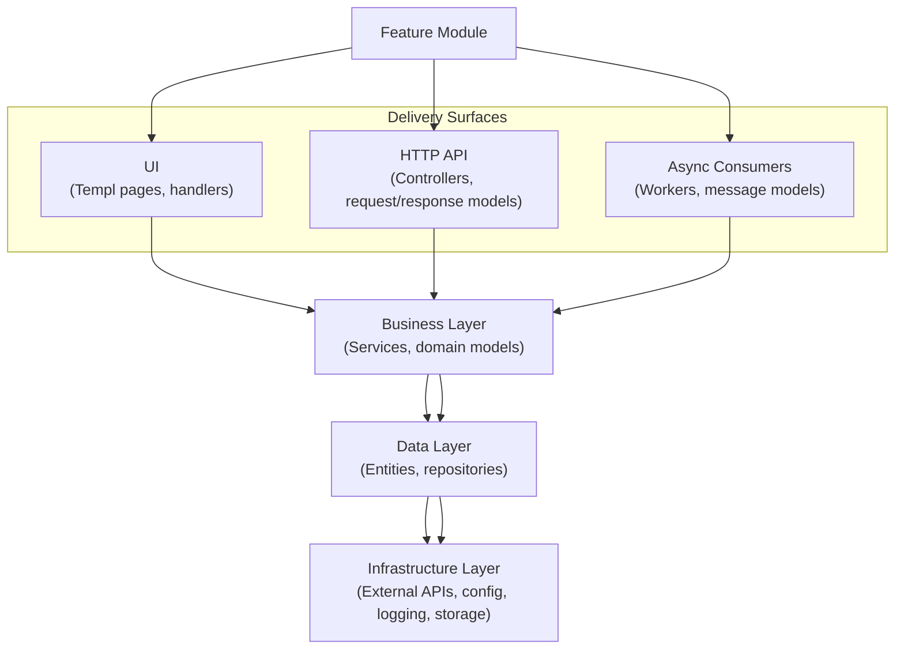

# Architecture Guide

## Philosophy and Goals
- Provide a modular, domain-driven scaffold for future pharmacy-related services.
- Encourage explicit wiring of dependencies so cross-domain coupling stays intentional.
- Keep delivery layers (HTTP APIs and server-rendered UI) thin and focused on orchestration.
- Support swapping infrastructure concerns (logging, integrations, configuration) without changing domain logic.

## Application Startup Flow
1. **Entry point** – `cmd/server/main.go` loads configuration and instantiates `internal/app.App`.
2. **App wiring** – `internal/app/app.go` calls `wire()` (`internal/app/wire.go`) to construct the logger, shared HTTP client, router, integrations, and domain modules.
3. **Router & middleware** – `wire()` builds a `chi` router, attaches platform middleware (request ID, correlation ID, Zap request logging, timeout), and mounts static assets from `web/public`.
4. **Module registration** – Each domain exposes a `Module(chi.Router, *ModuleDependencies) ModuleExport` function. `wire()` invokes these to connect domains, API routes, and UI handlers.
5. **HTTP server** – `App.Run()` starts `http.Server` with the configured port and the wired router.

## Project Layout
- `cmd/` – Binaries. `cmd/server` boots the web app; `cmd/iris_mock` starts a mock external service.
- `domain/` – Business capabilities split by bounded context (dashboard, patient, prescription). Each domain is self-contained.
- `internal/app/` – Composition root. Owns runtime wiring and lifecycle.
- `internal/platform/` – Cross-cutting infrastructure (config, logging, HTTP helpers).
- `internal/integrations/` – Adapters around third-party systems (Iris Pharmacy & Billing) exposed through module exports.
- `internal/configs/` – Default YAML configuration files loaded by the config package.
- `internal/helper/` – Reusable helper utilities (e.g., API response writers).
- `web/` – Shared UI assets: templated components, styles, and static files.
- `bin/` – Generated binaries or helper scripts (build output is ignored by Git).

## Layered Feature Flow

Delivery layers (UI, HTTP, async consumers) are peers that delegate to the same business services. Services depend on repositories and integrations for persistence or external communication. Infrastructure concerns remain isolated at the bottom, ensuring higher layers stay implementation agnostic.

## The Module Pattern
Every cohesive area (domain or integration) follows the same pattern:
- `ModuleDependencies` structs declare required inputs from the outside world.
- `Module()` functions perform construction, register handlers, and return a `ModuleExport`.
- `ModuleExport` structs expose the domain surface area other modules can rely on.

Example: `domain/patient/module.go` builds repositories and services, mounts API/UI routes, and exports `PatientService` & `AddressService` for cross-domain reuse. Module wiring prevents hidden globals and keeps dependency direction explicit.

### Providers & Cross-Domain Contracts
Domains define their external expectations as interfaces in a `providers` (or `contracts/providers`) package. The Dashboard module consumes `providers.PatientStatsProvider` and `providers.PrescriptionStatsProvider` (`domain/dashboard/providers/providers.go`). The Patient and Prescription modules satisfy those interfaces through their exported services, enabling loose coupling while preserving compile-time safety.

## Domain Package Structure
Each domain mirrors the same internal layout:
- `api/` – HTTP APIs that expose domain capabilities as REST endpoints.
  - `api/api.go` is the mounting point; it wires controllers into the shared router.
  - Controllers receive services via constructor injection and translate domain errors to HTTP responses (`domain/patient/api/controllers`).
- `service/` – Domain services that orchestrate repositories and integrations. Services expose interfaces consumed by UI, APIs, or other domains.
- `repository/` – Persistence abstractions and in-memory implementations. Swap these out for real databases while keeping service contracts stable.
- `contracts/` – Domain models and enumerations shared across layers (`domain/dashboard/contracts/model/dashboard_model.go`).
- `ui/` – Server-rendered pages built with [`templ`](https://templ.guide/) components. Each folder contains handlers, page templates (`*.templ`), and generated Go files (`*_templ.go`).
- `providers/` (optional) – Cross-domain interfaces a domain depends on, as seen in Dashboard.

### Dashboard Domain (`domain/dashboard`)
- Thin service `service/dashboard_service.go` aggregates data from patient/prescription providers to build a `DashboardSummary`.
- UI mounted at `/` via `ui/ui.go` renders `dashboard_page` with summaries.
- No API endpoints; it is read-only and composed entirely from other domains.

### Patient Domain (`domain/patient`)
- `service/` exposes `PatientService` & `AddressService` with list/get/count operations.
- `repository/` contains memory-backed repositories ready to be replaced by storage adapters.
- `api/controllers` map HTTP verbs to service calls; `internal/helper` is used to emit consistent JSON structures.
- UI mounts `/patients` list and detail pages; handlers compose shared layout components and domain data.

### Prescription Domain (`domain/prescription`)
- Depends on integrations for pharmacy & billing data via `ModuleDependencies`.
- Service layers orchestrate external calls and repositories before responding to API/UI requests.
- UI renders prescription-specific pages under `/prescriptions` (pattern mirrors patients).

## API Layer
- All routes share the main `chi.Router` created in `internal/app/wire.go`.
- Domain APIs register under `/api/v1/...` namespaces within their `Module` function, ensuring consistent versioning. Example: `domain/patient/api/api.go` mounts `/api/v1/patients` routes.
- Controllers should translate domain-level errors into HTTP semantics and leverage shared helpers (`internal/helper/api_response.go`) for JSON envelopes.
- Middleware stack establishes observability (Zap logging, correlation IDs), resilience (recoverer, timeout), and request identity.

## UI Layer
- Server-driven UI uses [Templ](https://templ.guide/) components compiled into Go (`*_templ.go`).
- Domain-specific UIs live beside their services (`domain/<domain>/ui`), keeping workflows close to the business logic they rely on.
- Each UI package exposes a `MountUI` function that registers handlers and composes shared components from `web/components`.
- Layout and shared visuals reside in `web/components/layouts` and `web/components/elements` (page headers, tables, cards) to ensure consistent look & feel across domains.
- Static assets (images, CSS) are served from `web/public` via the router handler registered in `internal/app/wire.go`.

## Shared Web Components
- `web/components/layouts/` – Top-level page shells (e.g., `base.templ`, `sidebar.templ`) consumed by domain pages for structural consistency.
- `web/components/elements/` – Reusable UI atoms/molecules (pagination, statistics cards, tables).
- `web/components/svg/` – Iconography compiled into Go template functions.
- `web/styles/` – Tailwind configuration and global CSS files used by components/pages.

## Integrations
- Centralized in `internal/integrations`, each external system is wrapped in its own module (`iris_pharmacy`, `iris_billing`).
- `ModuleDependencies` capture configuration, logger, optional custom HTTP client, and allow toggling mock implementations.
- `ModuleExport` exposes typed clients that domain services consume. `internal/integrations/integration_wire.go` glues the configured clients together for the app.
- Mock implementations (`cmd/iris_mock`, `internal/integrations/*/mock_client.go`) enable local development without real network calls. JSON responses mimic production contracts.

## Platform Services
- **Configuration** (`internal/platform/config`): layered YAML + environment variables with sane defaults. Used by app wiring and integrations.
- **Logging** (`internal/platform/logging`): constructs structured Zap loggers and provides HTTP middleware for request/response logging plus correlation IDs.
- **HTTP Utilities** (`internal/platform/httpx`): central place to create tuned `http.Client` instances for integrations.

## Adding a New Domain Module
1. Create `domain/<name>/` with `contracts`, `repository`, `service`, `api`, and `ui` subpackages.
2. Define interfaces in `providers/` if the domain needs data from others; consume exports from existing modules when wiring.
3. Implement a `ModuleDependencies` struct capturing required services/clients and a `Module()` function that wires repositories, services, APIs, and UI.
4. Update `internal/app/wire.go` to instantiate the module, pass in dependencies, and consume its `ModuleExport` where needed.
5. Reuse shared web components and helper utilities to maintain consistency.

This structure keeps domains independent, makes wiring explicit, and provides a clear template for future services.
