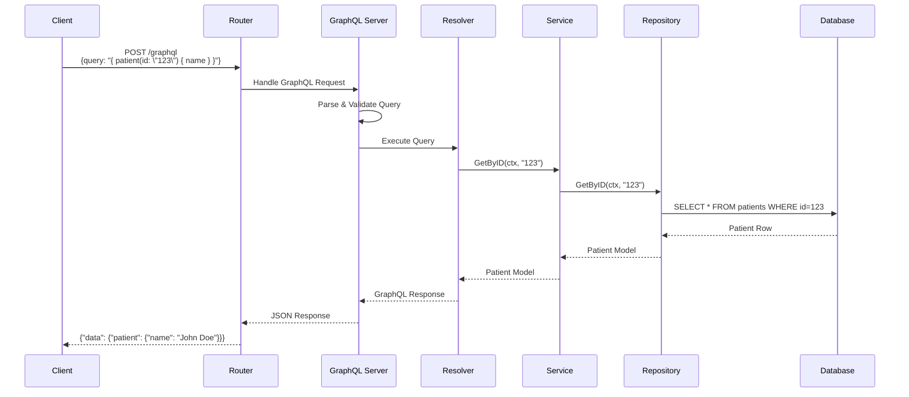
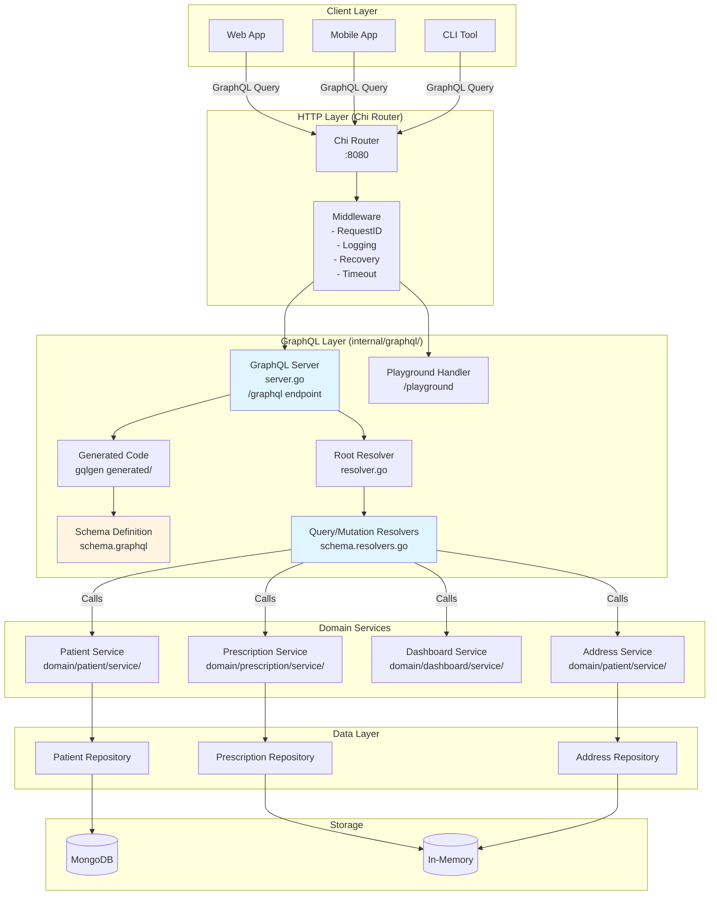
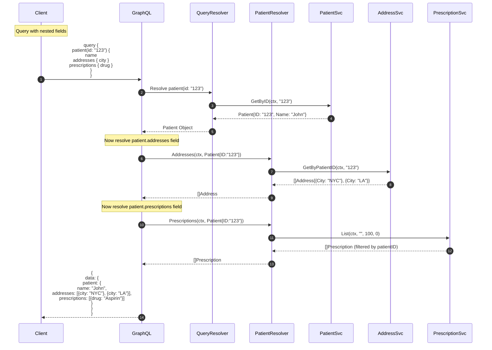
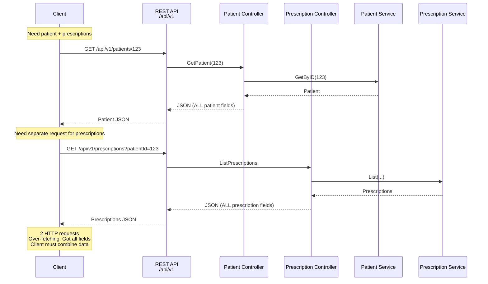
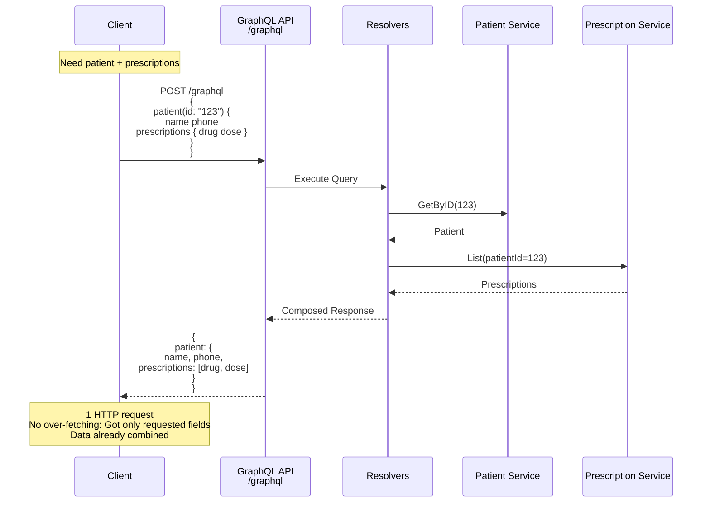

# GraphQL Architecture Diagrams

Visual representations of how GraphQL works in the rxintake_scaffold application.

## Table of Contents
1. [High-Level Request Flow](#high-level-request-flow)
2. [Detailed Component Architecture](#detailed-component-architecture)
3. [Query Resolution Flow](#query-resolution-flow)
4. [Nested Query Resolution](#nested-query-resolution)
5. [Comparison: REST vs GraphQL](#comparison-rest-vs-graphql)
6. [Code Generation Workflow](#code-generation-workflow)

---

## High-Level Request Flow



---

## Detailed Component Architecture



---

## Query Resolution Flow

### Simple Query: Get Single Patient

```mermaid
flowchart LR
    subgraph "1. Query Arrives"
        Query["query {<br/>  patient(id: \"123\") {<br/>    name<br/>    phone<br/>  }<br/>}"]
    end
    
    subgraph "2. GraphQL Server"
        Parse[Parse Query]
        Validate[Validate Against Schema]
        Plan[Create Execution Plan]
    end
    
    subgraph "3. Root Resolver"
        QueryResolver[queryResolver.Patient<br/>id: \"123\"]
    end
    
    subgraph "4. Service Layer"
        PatientSvc[PatientService.GetByID<br/>ctx, \"123\"]
    end
    
    subgraph "5. Repository"
        PatientRepo[PatientRepository.GetByID<br/>ctx, \"123\"]
    end
    
    subgraph "6. Database"
        DB[(MongoDB/<br/>Memory)]
    end
    
    subgraph "7. Response"
        Response["{<br/>  data: {<br/>    patient: {<br/>      name: \"John Doe\"<br/>      phone: \"555-1234\"<br/>    }<br/>  }<br/>}"]
    end
    
    Query --> Parse --> Validate --> Plan
    Plan --> QueryResolver
    QueryResolver --> PatientSvc
    PatientSvc --> PatientRepo
    PatientRepo --> DB
    DB -.->|Patient Data| PatientRepo
    PatientRepo -.->|Patient Model| PatientSvc
    PatientSvc -.->|Patient Model| QueryResolver
    QueryResolver -.->|GraphQL Object| Response
```

---

## Nested Query Resolution

### Complex Query: Patient with Addresses and Prescriptions



### N+1 Query Problem Illustrated

```mermaid
graph TD
    subgraph "Query"
        Q["query {<br/>  patients {<br/>    name<br/>    prescriptions { drug }<br/>  }<br/>}"]
    end
    
    subgraph "Query 1: Get All Patients"
        P1[Patient 1]
        P2[Patient 2]
        P3[Patient 3]
        PN[Patient N]
    end
    
    subgraph "N Queries: Get Prescriptions Per Patient"
        RX1[Get Prescriptions<br/>for Patient 1]
        RX2[Get Prescriptions<br/>for Patient 2]
        RX3[Get Prescriptions<br/>for Patient 3]
        RXN[Get Prescriptions<br/>for Patient N]
    end
    
    Q --> P1 & P2 & P3 & PN
    P1 --> RX1
    P2 --> RX2
    P3 --> RX3
    PN --> RXN
    
    style Q fill:#ffcccc
    style RX1 fill:#ffcccc
    style RX2 fill:#ffcccc
    style RX3 fill:#ffcccc
    style RXN fill:#ffcccc
    
    Note1[⚠️ This creates 1 + N database calls<br/>Solution: Add DataLoader in Phase 2+]
    RXN -.-> Note1
```



---

## Comparison: REST vs GraphQL

### REST API Flow



### GraphQL Flow



---

## Code Generation Workflow

```mermaid
flowchart TB
    subgraph "1. Define Schema"
        Schema[internal/graphql/schema.graphql<br/>---<br/>type Patient {<br/>  id: ID!<br/>  name: String!<br/>}]
    end
    
    subgraph "2. Configure gqlgen"
        Config[gqlgen.yml<br/>---<br/>schema: internal/graphql/*.graphql<br/>resolver: internal/graphql<br/>autobind: domain models]
    end
    
    subgraph "3. Run Generator"
        Cmd[$ gqlgen generate]
    end
    
    subgraph "4. Generated Code"
        GenCode[internal/graphql/generated/<br/>---<br/>- generated.go<br/>- models_gen.go]
        ResolverStubs[internal/graphql/<br/>schema.resolvers.go<br/>---<br/>func queryResolver Patient<br/>  panic not implemented]
    end
    
    subgraph "5. Implement Resolvers"
        ImplResolvers[internal/graphql/<br/>schema.resolvers.go<br/>---<br/>func queryResolver Patient {<br/>  return r.PatientService.GetByID<br/>}]
    end
    
    subgraph "6. Wire Dependencies"
        Wire[internal/app/wire.go<br/>---<br/>graphql.MountGraphQL r,<br/>  PatientService,<br/>  PrescriptionService,<br/>  ...]
    end
    
    subgraph "7. Server Ready"
        Server[GraphQL Server Running<br/>---<br/>✓ /graphql endpoint<br/>✓ /playground endpoint]
    end
    
    Schema --> Config
    Config --> Cmd
    Cmd --> GenCode
    Cmd --> ResolverStubs
    ResolverStubs --> ImplResolvers
    ImplResolvers --> Wire
    Wire --> Server
    
    style Cmd fill:#d4f1d4
    style ImplResolvers fill:#ffe6cc
    style Server fill:#d4e6f1
```

---

## Dependency Injection Flow

```mermaid
graph TD
    subgraph "Application Startup (internal/app/wire.go)"
        Main[main.go starts app]
        Wire[wire function]
    end
    
    subgraph "Module Initialization"
        PatientMod[Patient Module]
        PrescriptionMod[Prescription Module]
        DashboardMod[Dashboard Module]
    end
    
    subgraph "Services Created"
        PatientSvc[Patient Service]
        AddressSvc[Address Service]
        PrescriptionSvc[Prescription Service]
        DashboardSvc[Dashboard Service]
    end
    
    subgraph "GraphQL Setup (internal/graphql/)"
        Deps[GraphQL Dependencies{<br/>  PatientService<br/>  AddressService<br/>  PrescriptionService<br/>  DashboardService<br/>  Logger<br/>}]
        Resolver[Root Resolver<br/>resolver.go]
        Server[GraphQL Server<br/>server.go]
        Mount[Mount to Router<br/>/graphql<br/>/playground]
    end
    
    Main --> Wire
    Wire --> PatientMod
    Wire --> PrescriptionMod
    Wire --> DashboardMod
    
    PatientMod --> PatientSvc
    PatientMod --> AddressSvc
    PrescriptionMod --> PrescriptionSvc
    DashboardMod --> DashboardSvc
    
    PatientSvc --> Deps
    AddressSvc --> Deps
    PrescriptionSvc --> Deps
    DashboardSvc --> Deps
    
    Deps --> Resolver
    Resolver --> Server
    Server --> Mount
    
    style Deps fill:#e1f5ff
    style Resolver fill:#e1f5ff
    style Mount fill:#d4f1d4
```

---

## File Structure & Responsibilities

```
internal/graphql/
├── schema.graphql              📄 Schema Definition
│   ├─ Defines all types (Patient, Prescription, etc.)
│   ├─ Defines all queries (patient, patients, etc.)
│   └─ Defines all mutations (future)
│
├── server.go                   🖥️  Server Setup
│   ├─ MountGraphQL() function
│   ├─ Creates resolver with dependencies
│   ├─ Configures gqlgen handler
│   └─ Mounts /graphql and /playground endpoints
│
├── resolver.go                 🔧 Dependency Container
│   ├─ Resolver struct with all services
│   ├─ Injected by wire.go
│   └─ Never regenerated (you maintain this)
│
├── schema.resolvers.go         ⚙️  Resolver Implementations
│   ├─ Query resolvers (patient, patients, etc.)
│   ├─ Field resolvers (patient.addresses, etc.)
│   ├─ Mutation resolvers (future)
│   ├─ Calls domain services
│   └─ Regenerated with stubs, you implement logic
│
└── generated/                  🤖 Auto-Generated Code
    ├── generated.go            (GraphQL executor)
    └── models_gen.go           (Type mappings)
```

---

## Execution Model

### How a Query Gets Executed

```
1. Client sends query
   ↓
2. Chi Router receives POST /graphql
   ↓
3. Middleware chain executes
   - Request ID generation
   - Correlation ID
   - Logging
   - Panic recovery
   - Timeout
   ↓
4. GraphQL handler (from gqlgen) receives request
   ↓
5. Parse query into AST (Abstract Syntax Tree)
   ↓
6. Validate query against schema
   - Type checking
   - Field existence
   - Argument validation
   ↓
7. Create execution plan
   - Determine which resolvers to call
   - Determine execution order
   ↓
8. Execute resolvers in order
   - Root query resolver (e.g., patient)
   - Field resolvers (e.g., addresses, prescriptions)
   - Each resolver calls domain service
   ↓
9. Collect all resolved data
   ↓
10. Format as JSON response
   ↓
11. Send response to client
```

---

## Data Flow Diagram

```mermaid
flowchart LR
    subgraph Client
        Query["{<br/>  patient(id: \"123\") {<br/>    name<br/>    prescriptions {<br/>      drug<br/>    }<br/>  }<br/>}"]
    end
    
    subgraph GraphQL Layer
        Parse[Parse &<br/>Validate]
        QueryRes[Patient<br/>Query Resolver]
        FieldRes[Prescriptions<br/>Field Resolver]
    end
    
    subgraph Service Layer
        PatientSvc[Patient<br/>Service]
        PrescriptionSvc[Prescription<br/>Service]
    end
    
    subgraph Data Layer
        PatientRepo[(Patient<br/>Repository)]
        PrescriptionRepo[(Prescription<br/>Repository)]
    end
    
    Query -->|HTTP POST| Parse
    Parse --> QueryRes
    QueryRes -->|GetByID| PatientSvc
    PatientSvc -->|Query| PatientRepo
    PatientRepo -.->|Patient| PatientSvc
    PatientSvc -.->|Patient Model| QueryRes
    
    QueryRes -.->|Patient Object| FieldRes
    FieldRes -->|List| PrescriptionSvc
    PrescriptionSvc -->|Query| PrescriptionRepo
    PrescriptionRepo -.->|Prescriptions| PrescriptionSvc
    PrescriptionSvc -.->|Prescriptions| FieldRes
    
    FieldRes -.->|Complete Response| Query
    
    style Parse fill:#e1f5ff
    style QueryRes fill:#e1f5ff
    style FieldRes fill:#e1f5ff
```

---

## Summary

### Key Takeaways

1. **GraphQL sits as a delivery layer** - Same level as REST API and UI
2. **Resolvers are thin** - They just call services, no business logic
3. **Services are shared** - REST, GraphQL, and UI all use the same services
4. **Type-safe** - gqlgen generates code from schema
5. **Flexible queries** - Clients request exactly what they need
6. **Nested resolution** - GraphQL automatically resolves nested fields
7. **Single endpoint** - All queries go through `/graphql`

### Benefits of This Architecture

- ✅ No code duplication (services shared with REST)
- ✅ Type safety (compile-time checks)
- ✅ Easy to add new fields (update schema → regenerate)
- ✅ Client flexibility (request only needed fields)
- ✅ Single HTTP request for complex data
- ✅ Same middleware as REST (logging, errors, etc.)
- ✅ Simple to understand and maintain

